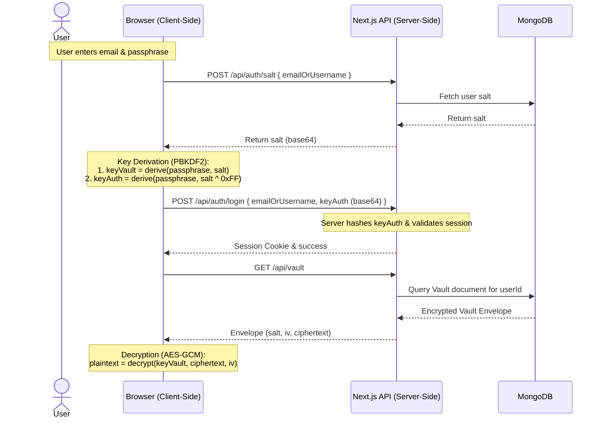

# Blackhole Vault - Agent Guide & Rules

Welcome to **Blackhole Vault**, a secure, client-side encrypted password manager and vault built with Next.js (App Router), TypeScript, and MongoDB.

This file serves as a guide for agent interaction with the Blackhole Vault codebase. Read this document before making any code modifications or additions to ensure compatibility with the project's zero-knowledge security guarantees, concurrency models, and architecture.

---

## 🏛️ Project Architecture & Cryptographic Workflow

Blackhole Vault operates on a **zero-knowledge architecture**. All cryptographic operations (key derivation, encryption, and decryption) are executed strictly in the user's browser via the native Web Crypto API.



### 1. Key Derivation (Dual Keys)
When registering or logging in:
- A random salt is generated.
- The passphrase and salt are processed using **PBKDF2-SHA256** with **600,000 iterations** to derive `keyVault` (used to encrypt/decrypt the vault client-side).
- To log in without revealing the vault encryption key, an authentication key `keyAuth` is derived by using a bitwise inverted version of the salt (`salt ^ 0xFF`) and the passphrase.
- `keyAuth` is exported as base64 and sent to the server for authentication (where it is hashed and compared to the stored password hash).
- `keyVault` is **never** sent to the server.

### 2. Encryption/Decryption
- Vault data is serialized into JSON and encrypted using **AES-GCM (256-bit)** with a random **96-bit (12 bytes) IV** and `keyVault`.
- The server stores the `ciphertext`, `iv`, `salt`, and KDF parameters inside the MongoDB collection `vaults`.

---

## 💾 Concurrency Control & Data Limits

### 1. Optimistic Concurrency Control (OCC)
To prevent data loss from concurrent writes (e.g., when a user is logged in on multiple tabs or devices), the vault uses a versioning scheme:
- The `Vault` database schema includes a `version` field (type: `Number`, default: `1`).
- When saving a vault via `POST /api/vault`, the client sends `clientVersion` (matching the version it last read).
- The server executes:
  ```typescript
  const updatedVault = await Vault.findOneAndUpdate(
    { user: session.userId, version: clientVersion },
    { $set: { ciphertext, iv, salt, kdfParams }, $inc: { version: 1 } },
    { new: true }
  );
  ```
- If `updatedVault` is null, it indicates a mismatch (another device has written to the vault in the meantime). The server returns a `409 Sync Conflict` error, prompting the client to sync.

### 2. Vault Limits
- **Maximum Vault Size:** The ciphertext base64 string is capped at **500,000 characters** in the `POST /api/vault` endpoint to prevent storage abuse. If exceeded, the server returns a `413 Vault too large` response.
- **Rate Limiting:** Saving the vault is rate-limited to **10 requests per minute** per IP.

---

## 🧱 Codebase Layout

- `src/types/vault.ts`: Cryptographic type declarations (`VaultEntry`, `PlaintextVault`, `VaultEnvelope`).
- `src/models/`: MongoDB mongoose models:
  - `User.ts`: Users are identified by `email` or `username` (alphanumeric + `_` + `-`, 3–30 chars). Single-session ID (`activeSessionId`) and timestamp tracking (`lastActiveAt`).
  - `Vault.ts`: Houses the encrypted vault payloads.
- `src/lib/`: Core helpers and test suites.
  - [crypto.ts](file:///A:/Blackhole/src/lib/crypto.ts): Key derivation, encryption, decryption, UUID generation (safely fallback across web and node contexts), and memory sanitization (`safeZero`).
  - [password-audit.ts](file:///A:/Blackhole/src/lib/password-audit.ts): Password health analyzer (checks for length, character sets, repetition, common passwords, reused passwords, stale credentials >180 days).
  - [vault-transfer.ts](file:///A:/Blackhole/src/lib/vault-transfer.ts): Implements vault JSON/CSV parsing, normalization, export preparation, and merging logic.
- `src/context/`:
  - [VaultContext.tsx](file:///A:/Blackhole/src/context/VaultContext.tsx): Global state provider for user authentication, key refs (`keyRef`, `saltRef`), local plaintext vault memory (`vaultData`), auto-logout timing (logs out after 3 mins of idle time), and tab visibility checks (re-validates session against server when tab is refocused).
- `src/components/`:
  - `vault/`: Dashboards, modals, passwords and API lists, drag-and-drop reordering lists (using `framer-motion` `Reorder.Group`), and playground.
  - `ui/`: Design tokens, branding, stars canvas background, and loader animations.

---

## 🛠️ Development & Coding Rules

When contributing code or reviewing modifications, strictly adhere to the following rules:

### 🔒 Security Guidelines
1. **Never Log Sensitive Information:** Do not print or log master passwords, raw passphrases, decrypted entry values (`password`, `apikey`, `remarks`, `custom`), `keyVault`, or derived key buffers to the console or external services.
2. **Sanitize Key Memory:** Always clear out cryptographic key arrays immediately after use using the `safeZero` utility:
   ```typescript
   safeZero(buffer);
   ```
3. **No Server-Side Plaintext Handling:** Never process decrypted vault elements on the server. If a new API endpoint is created, ensure that only encrypted envelopes are received or transmitted.
4. **Cookie Security:** The session cookie (`blackhole-session`) is configured via `iron-session` with `ttl: 0` (expires upon browser exit), `httpOnly: true`, and `sameSite: 'lax'`. Do not downgrade these settings.

### 🧩 Coding & Styling Standards
1. **Tailwind CSS & Theme:** Blackhole Vault uses a custom **"void" black aesthetic**. Rely on CSS variables defined in [main.css](file:///A:/Blackhole/src/app/main.css) (`--bg-void`, `--bg-card`, `--border-subtle`, `--accent-primary`, etc.) or Tailwind utility classes that correspond to these variables. Avoid using generic/bright Tailwind color variants directly unless they align with design variables.
2. **TypeScript Integrity:** Maintain strict TypeScript typings. Avoid arbitrary `any` declarations. Use specific types from `src/types/vault.ts` or local component prop interfaces.
3. **Framer Motion for Reordering:** List reordering relies on `framer-motion`. Ensure that dragging triggers local state updates followed by calling `saveVault` for persistent backend storage.
4. **Optimistic Version Increments:** Ensure that updates directly write back to the backend referencing the correct local version state, handling potential `409 Sync Conflict` errors gracefully in component logic.

### 🧪 Testing Guidelines
- Run unit and integration tests with `npm test`.
- Add test coverage in corresponding `.test.ts` files inside `src/lib/` for any changes made to critical libraries.
- Avoid introducing browser APIs inside test contexts without checking for mock availability or standard node fallbacks.
